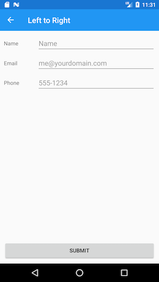
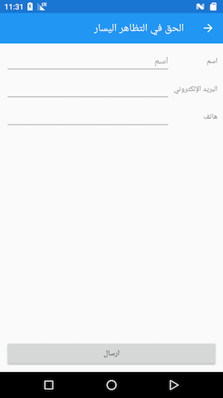

# Right-to-Left support in Xamarin.Forms 3.0

 

Xamarin.Forms 3.0 now includes Right-to-Left language support. In the corresponding lightning lecture for this talk you’ll see what need to be done to add Right-To-Left support in your apps. 

You’ll be introduced to the FlowDirection type, how it is used and how to obtain the flow direction based on the devices locale. You’ll also see how to configure your iOS, Android and UWP projects to support Right-to-Left as well as some useful resources to help on your way to taking your apps international. 
